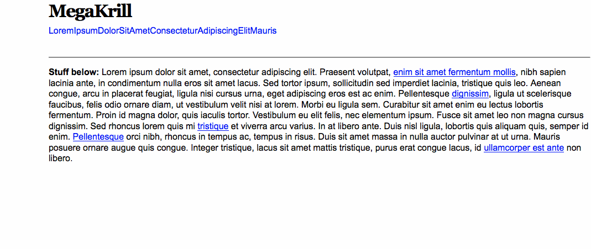

# [jQuery](http://jquery.com/) MegaKrill



## About

Compact navigation for mobile devices and responsive layouts.

## Demonstration

| Click or scan: |
| :-: | :-: |
| [](http://mhulse.github.io/jquery-megakrill/demo/) |
| Build: `$ grunt` or `$ npm run grunt` |

Resize the browser window to see the plugin(s) in action (Firefox 15+ users, check out [Responsive Design View](https://developer.mozilla.org/en-US/docs/Tools/Responsive_Design_View)).

**Source:** [jquery.megakrill.js](https://raw.github.com/mhulse/jquery-megakrill/gh-pages/megakrill/jquery.megakrill.js) | [jquery.megakrill.min.js](https://raw.github.com/mhulse/jquery-megakrill/gh-pages/megakrill/jquery.megakrill.min.js)

## Installation

1. Download as a [`zip`](https://github.com/mhulse/jquery-megakrill/archive/gh-pages.zip).
1. Clone it: `$ git clone https://github.com/mhulse/jquery-megakrill.git`.
1. Fork it and clone: `$ git clone git@github.com:USERNAME/jquery-megakrill.git`.
1. Just grab the relevant [JS](https://raw.github.com/mhulse/jquery-megakrill/gh-pages/megakrill/jquery.megakrill.js) ([uglified](https://raw.github.com/mhulse/jquery-megakrill/gh-pages/megakrill/jquery.megakrill.min.js)) and CSS (see “[Styling](#styling)” notes below) files.
1. Using [Bower](http://bower.io/): `$ bower install https://github.com/mhulse/jquery-megakrill.git`.

## Usage

Follow these steps …

### Markup:

See [demo page HTML](https://github.com/mhulse/jquery-megakrill/blob/gh-pages/demo/index.html).

### Styling:

**DISCLAIMER:** While I’ve done my best to make this code as plug-and-play as possible, you’ll most likely have to customize the CSS to suit your needs.

With that said, until I can resolve [issue #26](https://github.com/mhulse/jquery-megakrill/issues/26), you’ll want to combine/modify the [packaged](https://github.com/mhulse/jquery-megakrill/blob/gh-pages/megakrill/jquery.megakrill.css) and [demo](https://github.com/mhulse/jquery-megakrill/blob/gh-pages/demo/demo.css) page’s CSS files to get this working just right for you project.

### Javascript:

Put [jQuery](http://jquery.com/) on your page:

```html
<script src="//ajax.googleapis.com/ajax/libs/jquery/1.11.1/jquery.min.js"></script>
```

… and link to the plugin:

```html
<script src="jquery.megakrill.min.js"></script>
```

Finally, instantiate the plugin:

```html
<script>
	$(document).ready(function() {
		$('#megakrill').megakrill();
	});
</script>
```

#### Options:

Option | Description | Default
:-- | :-- | :--
`animIn` | What animation object to use to show the submenus. | `{ height: 'toggle' }`
`animOut` | IBID, but for hiding. | `{ height: 'toggle' }`
`clone` | Set to false if you don't want to clone target object. | `true`
`cloneId` | Auto clone id? One of `<id>`, true or false. | `true`
`easeIn` | Easing function in. | `swing`
`easeOut` | Easing function out. | `swing`
`cloneRemove` | Element(s) for the clone to remove. | `false`
`speedIn` | Animation speed in. | `normal`
`speedOut` | Animation speed out. | `normal`
`onInit` | Callback after plugin data initialized. | `$.noop`
`onAfterInit` | After plugin initialization. | `$.noop`
`onBeforeShow` | Before reveal animation begins. | `$.noop`
`onShow` | After reveal animation ends. | `$.noop`
`onBeforeHide` | Before hide animation begins. | `$.noop`
`onHide` | After hide animation ends. | `$.noop`

## Links

### Related repositories:

1. [jQuery MegaWhale](https://github.com/mhulse/jquery-megawhale)
1. [jQuery Mega demos!](https://github.com/mhulse/jquery-mega-demos)

### In the wild:

This code was originally developed for [The Register-Guard](http://registerguard.com).

## Development

Assuming you already have [Grunt.js](http://gruntjs.com/) installed …

**Note:** The Grunt [command line interface](https://github.com/gruntjs/grunt-cli) gets installed locally, so you can skip `$ npm install -g grunt-cli` if you use the `$ npm run` commands.

### Setup dependencies:

Navigate to the local repo’s `build/` directory:

```bash
$ cd jquery-megakrill/build/
```

Install Grunt tasks:

```bash
$ npm install
```

### Preview:

Test the development build:

```bash
$ grunt
# … or:
$ grunt default
# … or:
$ npm run grunt
```

Visit the demo page:

<http://localhost/grunt-html-boiler/dev/>

**Note:** The above URL will depend upon your local development environment; for previewing my projects I use [XAMPP](http://www.apachefriends.org/index.html).

### Edit:

At this point, you can modify any of the files, especially the ones found in the `build/files/` directory.

To make life easier while developing, run:

```bash
$ grunt watch
# … or:
$ npm run watch
```

… the `watch` command will run a development build any time these directories/file(s) change:

```text
build/Gruntfile.js
build/files/jquery.megakrill.js
build/files/jquery.megakrill.css
```

### Bumping the version:

When a build is ready for a version bump ...

1. Update `version` key value in `source/package.json`.
1. Update `version` key value in `bower.json`.
1. Build: `$ grunt`.
1. Update the [changelog](#changelog) and [release history](#release-history) in the [README.md](https://github.com/mhulse/megakrill/blob/gh-pages/README.md) (if copy/pasting, don't forget to update the date and version numbers).
1. Push changes to GitHub.
1. Visit the [releases page](https://github.com/mhulse/megakrill/releases) and click "[Draft a new release](https://github.com/mhulse/megakrill/releases/new)".
1. Type the new version number in the "Tag version" field (e.g., `v1.2.1`).
1. Click "Publish release".

**Note:** MegaKrill uses [Semantic Versioning](http://semver.org/).

### Update:

When finished, push your changes back to GitHub and submit a pull request …

## Contributing

Please read the [CONTRIBUTING.md](https://github.com/mhulse/jquery-megakrill/blob/gh-pages/CONTRIBUTING.md).

## Feedback

[Bugs? Constructive feedback? Questions?](https://github.com/mhulse/jquery-megakrill/issues/new?title=Your%20code%20sucks!&body=Here%27s%20why%3A%20)

## Changelog

* [v1.2.0 milestones](https://github.com/mhulse/jquery-megakrill/issues?milestone=1&q=is%3Aclosed+sort%3Aupdated-desc)

## [Release history](https://github.com/mhulse/jquery-megakrill/releases)

* 2014-08-10   [v1.2.0](https://github.com/mhulse/jquery-megakrill/releases/tag/v1.2.0)   2014 refresh.
* 2014-04-13   [v1.1.0](https://github.com/mhulse/jquery-megakrill/releases/tag/v1.1.0)   Stable.
* 2013-02-15   [v1.0.0](https://github.com/mhulse/jquery-megakrill/releases/tag/v1.0.0)   2013 stable.
* 2012-09-07   [v0.1.1](https://github.com/mhulse/jquery-megakrill/releases/tag/v0.1.1)   Bug fixes.
* 2012-08-05   [v0.1.0](https://github.com/mhulse/jquery-megakrill/releases/tag/v0.1.0)   Public release.

---

#### LEGAL

Copyright © 2013-2014 [Micky Hulse](http://mky.io)

Licensed under the Apache License, Version 2.0 (the “License”); you may not use this work except in compliance with the License. You may obtain a copy of the License in the LICENSE file, or at:

[http://www.apache.org/licenses/LICENSE-2.0](http://www.apache.org/licenses/LICENSE-2.0)

Unless required by applicable law or agreed to in writing, software distributed under the License is distributed on an “AS IS” BASIS, WITHOUT WARRANTIES OR CONDITIONS OF ANY KIND, either express or implied. See the License for the specific language governing permissions and limitations under the License.


